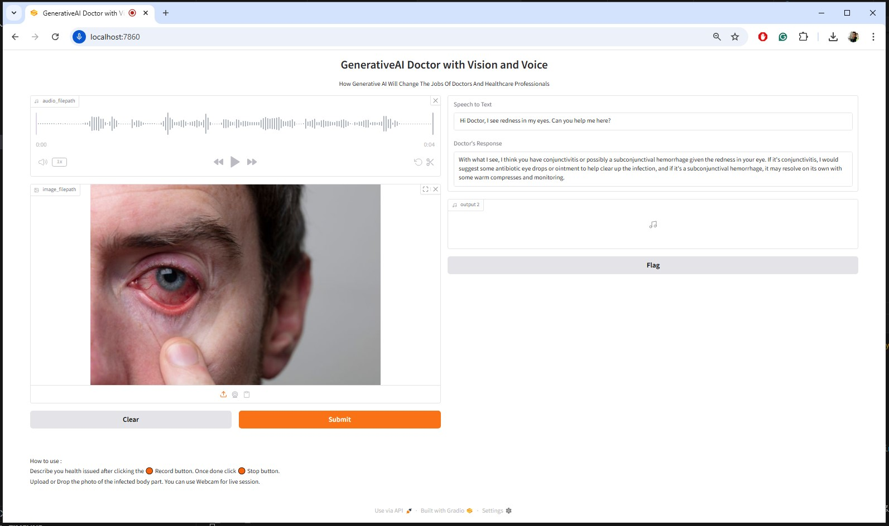

## GenerativeAI Healthcare Professionals with Vision and Voice [GROQ + ElevenLabs + Meta-llama]
How Generative AI Will Change The Jobs Of Doctors And Healthcare Professionals !!


# How to run?
### Steps :

Clone the repository

```bash
Project repo: https://github.com/vaibhavdhingani/GenAIMedicalChatbot.git
```

### Step-1 : Create a python environment after opening the repository
```bash
python -m venv medicalchatbotenv
source medicalchatbotenv/Scripts/activate
```

### Step-2 : install the requirements
```bash
pip install -r requirements.txt
```

### Step-3 : Create account for Groq and ElevenLabs and generate API Keys
```bash
https://console.groq.com/home
https://elevenlabs.io/
```

### Step-4 : Create a `.env` file in the root directory and add your Pinecone credentials as follows:
```ini
GROQ_API_KEY = "xxxxxxxxxxxxxxxxxxxxxxxxxxxxx"
ELEVENLABS_API_KEY = "xxxxxxxxxxxxxxxxxxxxxxxxxxxxx"
```

### Step-4 : Execute the python files:
```bash
python gradio_app.py
```
_[This repo has been verified with Python 3.12.5. I have seen few package compilation issues with higher version on Python.]_

### Step-5 : Execute the GenAIMedical Chatbot:
```bash
## Open localhost
open http://localhost:7860/
```

### Stack Used:
- GROQ
- ElevenLabs
- Gradio
- Meta Llama2


